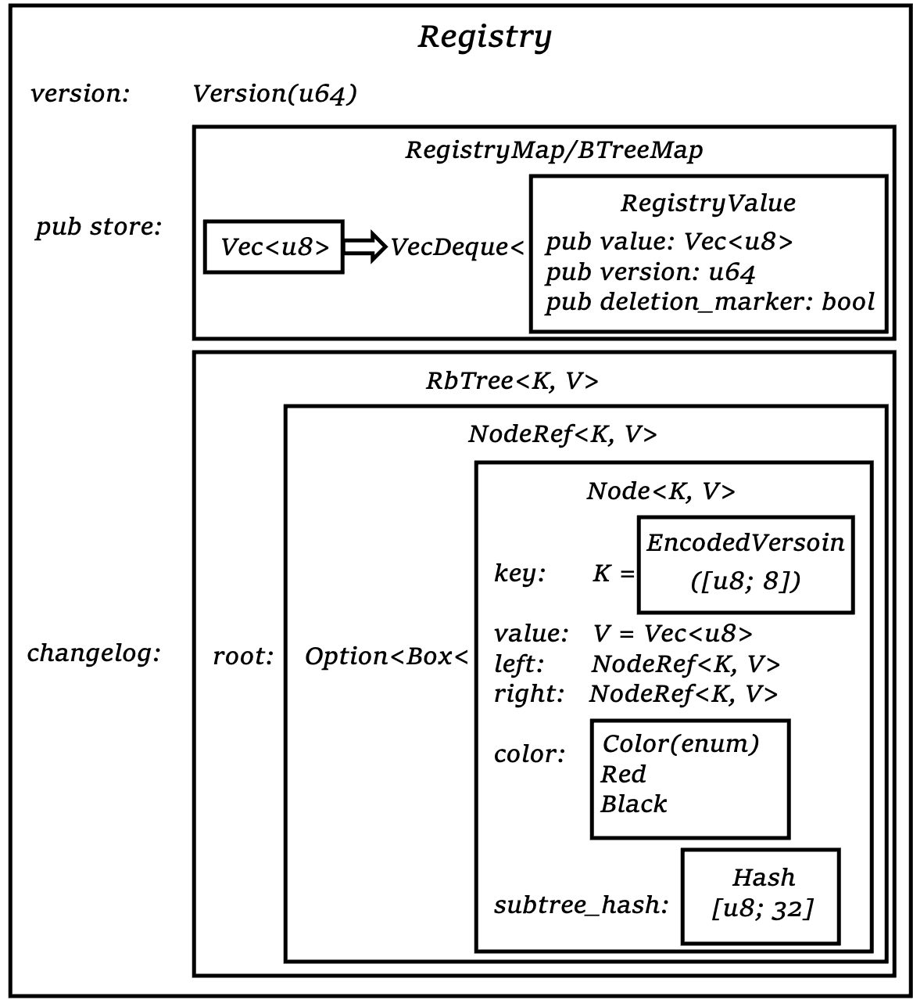
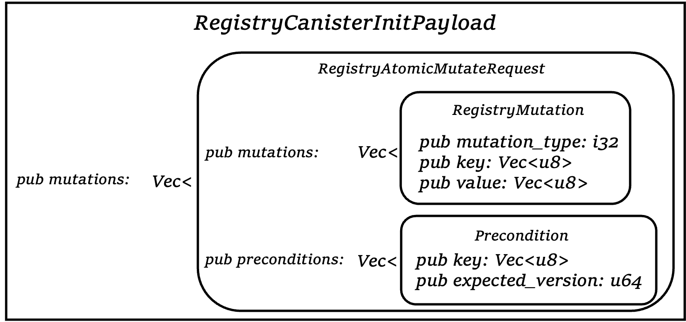
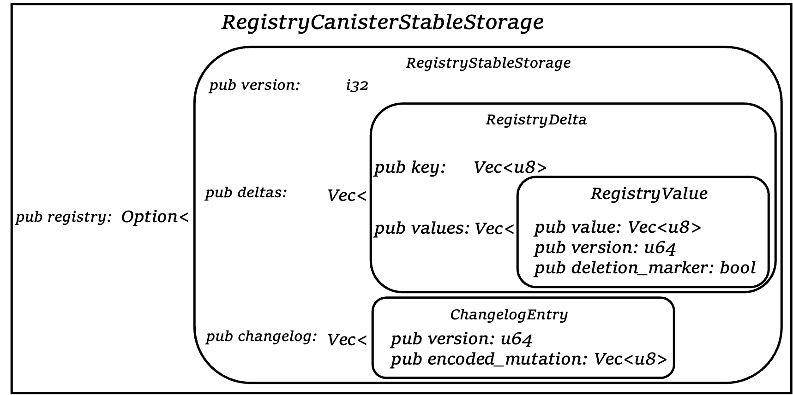

# NNS 系列之 Registry

# Contents
- [NNS 系列之 Registry](#nns-系列之-registry)
- [Contents](#contents)
  - [概述](#概述)
  - [数据结构](#数据结构)
    - [REGISTRY](#registry)
  - [接口函数](#接口函数)
    - [canister_init](#canister_init)
    - [canister_pre_upgrade](#canister_pre_upgrade)
    - [canister_post_upgrade](#canister_post_upgrade)
    - [update_authz](#update_authz)
    - [current_authz](#current_authz)
    - [get_changes_since](#get_changes_since)
    - [get_certified_changes_since](#get_certified_changes_since)
    - [get_value](#get_value)
    - [get_latest_version](#get_latest_version)
    - [get_certified_latest_version](#get_certified_latest_version)
    - [atomic_mutate](#atomic_mutate)
    - [bless_replica_version](#bless_replica_version)
    - [update_subnet_replica_version](#update_subnet_replica_version)
    - [update_icp_xdr_conversion_rate](#update_icp_xdr_conversion_rate)
    - [add_node](#add_node)
    - [add_node_operator](#add_node_operator)
    - [create_subnet](#create_subnet)
    - [add_nodes_to_subnet](#add_nodes_to_subnet)
    - [delete_subnet](#delete_subnet)
    - [recover_subnet](#recover_subnet)
    - [remove_nodes_from_subnet](#remove_nodes_from_subnet)
    - [remove_nodes](#remove_nodes)
    - [remove_node_directly](#remove_node_directly)
    - [update_node_operator_config](#update_node_operator_config)
    - [update_subnet](#update_subnet)
    - [clear_provisional_whitelist](#clear_provisional_whitelist)
    - [set_firewall_config](#set_firewall_config)
    - [update_node_rewards_table](#update_node_rewards_table)
    - [add_or_remove_data_centers](#add_or_remove_data_centers)
    - [update_unassigned_nodes_config](#update_unassigned_nodes_config)
    - [get_node_providers_monthly_xdr_rewards](#get_node_providers_monthly_xdr_rewards)

## 概述

Registry canister，功能上是执行。在 Governance 得到投票结果之后，Governance 就会调用 Registry 里面的 Functions 来具体执行。

## 数据结构

### REGISTRY


* 核心的数据结构就是 Registry。它有三个字段:
  * version，一个全局的计数器，每次有 mutation 作用于 Registry，就会 +1。
  * store 是真正存数据的地方，一个 Map，它的 Key 和 Value 需要转化成 u8（bytes） 数组。
  * changelog 所有的 mutation 的历史记录。


接下来看一下怎么示例化的。

实现了一个全局唯一的静态变量，`REGISTRY`，来存储所有的状态。

并且通过两个函数，`registry()` 以及 `registry_mut()` 来获取到这个变量。它们的区别是上面的 `registry()` 获取到的 `REGISTRY` 只读，不能更改它的状态，下面这个 `registry_mut()` 还能更改其状态。
```rs
static mut REGISTRY: Option<Registry> = None;

fn registry() -> &'static Registry {
    registry_mut()
}

fn registry_mut() -> &'static mut Registry {
    unsafe {
        if let Some(g) = &mut REGISTRY {
            g
        } else {
            REGISTRY = Some(Registry::new());
            registry_mut()
        }
    }
}
```

## 接口函数

### canister_init
在 `canister` 部署的时候，需要初始化一些状态，执行初始化函数，和 Solidity 的 constructor（构造函数）类似。比如部署一个 token 合约，需要初始化 token 的名字，符号，总量等信息。这就是 canister_init 函数的功能。

先执行了 `hook()` 函数，`hook()` 来自于 `dfn_core` 这个包里面，去看一下它的具体内容，它执行了两个函数，`set_stdout()` 和 `set_panic_hook()`。根据 `set_panic_hook()` 的具体内容，整的来说，`hook()` 它的功能是设置好标准输出，以及程序出现 Panic 时，把错误消息，以及所在文件，第几行，第几列打印出来。
```rs
// https://github.com/dfinity/ic/blob/8fffeb4be1/rs/registry/canister/canister/canister.rs#L118
dfn_core::printer::hook();


// https://github.com/dfinity/ic/blob/8fffeb4be1/rs/rust_canisters/dfn_core/src/printer.rs#L118-L146
/// Sets a custom panic hook, uses debug.trace
pub fn set_panic_hook() {
    panic::set_hook(Box::new(|info| {
        let file = info.location().unwrap().file();
        let line = info.location().unwrap().line();
        let col = info.location().unwrap().column();

        let msg = match info.payload().downcast_ref::<&'static str>() {
            Some(s) => *s,
            None => match info.payload().downcast_ref::<String>() {
                Some(s) => &s[..],
                None => "Box<Any>",
            },
        };

        let err_info = format!("Panicked at '{}', {}:{}:{}", msg, file, line, col);

        unsafe {
            log(&err_info);
        }
        crate::api::trap_with(&err_info);
    }));
}

/// Sets stdout, stderr, and a custom panic hook
pub fn hook() {
    set_stdout();
    set_panic_hook();
}
```

接下来执行 `recertify_registry()` 这个函数。
```rs
recertify_registry();

fn recertify_registry() {
    use ic_certified_map::{fork_hash, labeled_hash};

    let root_hash = fork_hash(
        &current_version_tree(registry().latest_version()).reconstruct(),
        &labeled_hash(b"delta", &registry().changelog().root_hash()),
    );
    set_certified_data(&root_hash);
}
```

先从里面开始看，`registry()` 返回了一个只读的那个全局的 Registry 实例。然后去拿它的 `latest_version()`，其实就是拿的它 version 字段的值，当前版本号，一个 u64 的值。

```rs
// https://github.com/dfinity/ic/blob/8fffeb4be1/rs/registry/canister/src/registry.rs#L177-L179
    pub fn latest_version(&self) -> Version {
        self.version
    }
```

然后把这个 Version 输入到 `current_version_tree()` 里面，看一下 `current_version_tree()` , 它接受一个 Version 类型，我们之前在 struct 看过，其实就是 u64，然后返回一个 Labeled 节点，把 current_version 存为数据，连接着一个 Leaf 叶子节点，里面存了传进去的 Version 的编码。


```rs
use ic_certified_map::{labeled, HashTree};

/// The maximum amount of bytes a 64-bit number can occupy when encoded in
/// LEB128.
const MAX_U64_ENCODING_BYTES: usize = 10;

pub fn current_version_tree(v: Version) -> HashTree<'static> {
    let mut buf = Vec::with_capacity(MAX_U64_ENCODING_BYTES);
    leb128::write::unsigned(&mut buf, v).unwrap();
    labeled(
        b"current_version",
        HashTree::Leaf(std::borrow::Cow::from(buf)),
    )
}
```
接下来需要看一下 HashTree 是怎么回事，以及包括 ic-certified-map crate（包） 的函数：fork_hash，labeled_hash。

下面定义了一个 HashTree 的数据结构，一个树结构，里面有几类节点，比如空节点；下面有两个子节点，它本身没有任何值的 Fork 节点；下面有一个节点，并且本身带标签（数据）的 Labeled 节点；或者只有数据的 Leaf 节点，或者是 [u8; 32] 的 Pruned 节点。
```rs
// https://github.com/dfinity/cdk-rs/blob/319795e9b4/src/ic-certified-map/src/hashtree.rs#L9-L49

/// SHA-256 hash bytes.
pub type Hash = [u8; 32];

/// HashTree as defined in the interfaces spec.
/// https://sdk.dfinity.org/docs/interface-spec/index.html#_certificate
#[derive(Debug)]
pub enum HashTree<'a> {
    Empty,
    Fork(Box<(HashTree<'a>, HashTree<'a>)>),
    Labeled(&'a [u8], Box<HashTree<'a>>),
    Leaf(Cow<'a, [u8]>),
    Pruned(Hash),
}

pub fn fork<'a>(l: HashTree<'a>, r: HashTree<'a>) -> HashTree<'a> {
    HashTree::Fork(Box::new((l, r)))
}

pub fn labeled<'a>(l: &'a [u8], t: HashTree<'a>) -> HashTree<'a> {
    HashTree::Labeled(l, Box::new(t))
}

pub fn fork_hash(l: &Hash, r: &Hash) -> Hash {
    let mut h = domain_sep("ic-hashtree-fork");
    h.update(&l[..]);
    h.update(&r[..]);
    h.finalize().into()
}

pub fn leaf_hash(data: &[u8]) -> Hash {
    let mut h = domain_sep("ic-hashtree-leaf");
    h.update(data);
    h.finalize().into()
}

pub fn labeled_hash(label: &[u8], content_hash: &Hash) -> Hash {
    let mut h = domain_sep("ic-hashtree-labeled");
    h.update(label);
    h.update(&content_hash[..]);
    h.finalize().into()
}

fn domain_sep(s: &str) -> sha2::Sha256 {
    let buf: [u8; 1] = [s.len() as u8];
    let mut h = Sha256::new();
    h.update(&buf[..]);
    h.update(s.as_bytes());
    h
}
```
所以 fork_hash, labeled_hash 都是输入不可变量，通过标准的 Sha256，然后往 Hash 的 buf 里面，填充一些自定义字段，比如 ic-hashtree-fork 这样的字符串。最后输出 32 位的 bytes 数组。

HashTree 实现了一个方法，reconstruct() 其实输入一个 HashTree，输出一个 Hash。Hash 就是 32 位的 Bytes 数组。
```rs
impl HashTree<'_> {
    pub fn reconstruct(&self) -> Hash {
        match self {
            Self::Empty => domain_sep("ic-hashtree-empty").finalize().into(),
            Self::Fork(f) => fork_hash(&f.0.reconstruct(), &f.1.reconstruct()),
            Self::Labeled(l, t) => {
                let thash = t.reconstruct();
                labeled_hash(l, &thash)
            }
            Self::Leaf(data) => leaf_hash(data),
            Self::Pruned(h) => *h,
        }
    }
}
```

可以再去我们之前的 Struct 图看一下，RbTree 是怎么定义的。这里给它实现了一个 root_hash() 的方法，其实就是拿的它 subtree_hash。
```rs
// https://github.com/dfinity/cdk-rs/blob/319795e9b4/src/ic-certified-map/src/hashtree.rs#L57-L63
impl<K: 'static + AsRef<[u8]>, V: AsHashTree + 'static> AsHashTree for RbTree<K, V> {
    fn root_hash(&self) -> Hash {
        match self.root.as_ref() {
            None => Empty.reconstruct(),
            Some(n) => n.subtree_hash,
        }
    }
}
```

所以整的来说，就是根据当前 Registry 的版本号，以及 changelog，生成了 32 位的 Hash 结果，root_hash。
```rs
    set_certified_data(&root_hash);

// https://github.com/dfinity/ic/blob/8fffeb4be1/rs/rust_canisters/dfn_core/src/api.rs#L840-L847
/// Sets the certified data of this canister.
///
/// # Panics
///
/// * This function traps if data.len() > 32.
pub fn set_certified_data(data: &[u8]) {
    // https://smartcontracts.org/docs/interface-spec/index.html#system-api-certified-data
    unsafe { ic0::certified_data_set(data.as_ptr() as u32, data.len() as u32) }
}

```
然后调用系统接口 certified_data_set 把这个 root_hash 设置成认证数据。认证数据的具体内容可以看 interface-spec 文档，也可以看[官方视频](https://youtu.be/mZbFhRIHIiY)，简单的说是你 query 一个数据的时候，没有经过全网共识，直接从一个节点拿的，可能该节点作恶。certified_data 是之前通过共识过放进去的，下次被 query 时还能携带一个全网的签名，就可以验证这个数据安全性很高的。好像 Canister Signature 也和这个东西有关，期待有人更深入的分享 certified_data 相关。

```rs
    let init_payload =
        Decode!(&arg_data(), RegistryCanisterInitPayload)
            .expect("The init argument for the registry canister must be a Candid-encoded RegistryCanisterInitPayload.");
    println!(
        "{}canister_init: Initializing with: {}",
        LOG_PREFIX, init_payload
    );

// https://github.com/dfinity/ic/blob/8fffeb4be1/rs/rust_canisters/dfn_core/src/api.rs#L656-L664
/// Returns the argument extracted from the message payload.
pub fn arg_data() -> Vec<u8> {
    let len: u32 = unsafe { ic0::msg_arg_data_size() };
    let mut bytes = vec![0; len as usize];
    unsafe {
        ic0::msg_arg_data_copy(bytes.as_mut_ptr() as u32, 0, len);
    }
    bytes
}
```
然后通过几个系统接口，msg_arg_data_size 和 msg_arg_data_copy，获取到这个函数的输入参数，因为是 canister_init，所以也是这个 canister 的安装参数。这个参数是 RegistryCanisterInitPayload 类型。

接着申明并初始化 init_payload 变量为 `Vec<u8>` 形式的参数解码成 RegistryCanisterInitPayload 类型的数据。




这个类型，首先有个唯一的字段 mutations，它是一个动态数组，而里面的 RegistryAtomicMutateRequest 有两个字段，其中一个也叫 mutations，另一个叫 preconditions。它们都是包裹了一些 `Vec<u8>` 的值。


```rs
    let registry = registry_mut();

    init_payload
        .mutations
        .into_iter()
        .for_each(|mutation_request| {
            registry.maybe_apply_mutation_internal(mutation_request.mutations)
        });
```
接着获取到了 Registry 示例，并且是可变的。接下来修改这个示例。

通过遍历 init_payload 的 mutations 这个数组里面的每一个 RegistryAtomicMutateRequest 类型的值，执行 maybe_apply_mutation_internal 方法，输入 RegistryAtomicMutateRequest 的 mutations 字段的数据（`Vec<RegistryMutation>`) 来修改 Registry 示例。

这个方法执行了哪些功能？
```rs
// https://github.com/dfinity/ic/blob/8fffeb4be1/rs/registry/canister/src/registry.rs#L271-L294
/// Checks that invariants hold after applying mutations
pub fn maybe_apply_mutation_internal(&mut self, mutations: Vec<RegistryMutation>) {
    println!(
        "{}Received a mutate call containing a list of {} mutations",
        LOG_PREFIX,
        mutations.len()
    );

    let errors = self.verify_mutation_type(mutations.as_slice());
    if !errors.is_empty() {
        panic!(
            "{}Transaction rejected because of the following errors: [{}].",
            LOG_PREFIX,
            errors
                .iter()
                .map(|e| format!("{}", e))
                .collect::<Vec::<String>>()
                .join(", ")
        );
    }

    self.check_global_invariants(mutations.as_slice());
    self.apply_mutations(mutations);
}
```
在做完一些验证和检查之后，真正的状态修改发生在 apply_mutations()

```rs
// https://github.com/dfinity/ic/blob/8fffeb4be1/rs/registry/canister/src/registry.rs#L226-L240
/// Applies the given mutations, without any check corresponding
/// to the mutation_type.
///
/// This should be called only after having made sure that all
/// preconditions are satisfied.
fn apply_mutations(&mut self, mutations: Vec<RegistryMutation>) {
    if mutations.is_empty() {
        // We should not increment the version if there is no
        // mutation, so that we keep the invariant that the
        // global version is the max of all versions in the store.
        return;
    }
    self.increment_version();
    self.apply_mutations_as_version(mutations, self.version);
}

// https://github.com/dfinity/ic/blob/8fffeb4be1/rs/registry/canister/src/registry.rs#L171-L185
/// Increments the latest version of the registry.
fn increment_version(&mut self) -> Version {
    self.version += 1;
    self.version
}

fn apply_mutations_as_version(
    &mut self,
    mut mutations: Vec<RegistryMutation>,
    version: Version,
) {
    // We sort entries by key to eliminate the difference between changelog
    // produced by the new version of the registry canister starting from v1
    // and the changelog recovered from the stable representation of the
    // original version that didn't support certification.
    mutations.sort_by(|l, r| l.key.cmp(&r.key));
    for m in mutations.iter_mut() {
        // We normalize all the INSERT/UPDATE/UPSERT operations to be just
        // UPSERTs. This serves 2 purposes:
        //
        // 1. This significantly simplifies reconstruction of the changelog
        //    when we deserialize the registry from the original stable
        //    representation.
        //
        // 2. This will play nicely with garbage collection: if an old
        //    INSERT entry is removed, the newly connected clients won't
        //    fail because of an UPDATE in the first survived entry with the
        //    same key.
        m.mutation_type = match Type::from_i32(m.mutation_type).unwrap() {
            Type::Insert | Type::Update | Type::Upsert => Type::Upsert,
            Type::Delete => Type::Delete,
        } as i32;
    }

    let req = RegistryAtomicMutateRequest {
        mutations,
        preconditions: vec![],
    };
    let bytes = pb_encode(&req);

    self.changelog.insert(version.into(), bytes);

    for mutation in req.mutations {
        (*self.store.entry(mutation.key).or_default()).push_back(RegistryValue {
            version,
            value: mutation.value,
            deletion_marker: mutation.mutation_type == Type::Delete as i32,
        });
    }
}


pub enum Type {
    /// Key is expected to not exist in the registry at the current version.
    /// (This includes the case of a key that has existed in the past and
    /// later got deleted).
    /// The mutation will fail otherwise.
    Insert = 0,
    /// Key is expected to exist in the registry at the current version.
    /// The mutation will fail otherwise.
    Update = 1,
    /// Key is expected to exist in the registry at the current version.
    /// The mutation will fail otherwise.
    Delete = 2,
    /// If the key does not exist at the current version, it will be created.
    /// Otherwise, the value will be updated. The name is common in the
    /// database world, and means Update or Insert.
    Upsert = 4,
}
```
先对输入 mutations 进行了修改，然后对整个 RegistryAtomicMutateRequest 编码，并写入 changelog，然后把 RegistryMutation 按照 key 和 value 写入到 store。

整的来说是把参数里面的数据结构写入到 Registry，并且增加了 n 个版本号，插入了 n 条 changelog。在 store 里面增加了 n $\times$ m 个数据对。其中 n 是最外面 mutations 的数据长度，m 是里面的 mutations 的平均长度。

### canister_pre_upgrade

升级前函数，将系统的状态先提前 stable 保存一下，然后在升级的时候 stable 保存的数据是不会丢失的，然后升级之后有一个升级后函数讲数据恢复出来。
```rs
#[export_name = "canister_pre_upgrade"]
fn canister_pre_upgrade() {
    println!("{}canister_pre_upgrade", LOG_PREFIX);
    let registry = registry_mut();
    let mut serialized = Vec::new();
    let ss = RegistryCanisterStableStorage {
        registry: Some(registry.serializable_form()),
    };
    ss.encode(&mut serialized)
        .expect("Error serializing to stable.");
    stable::set(&serialized);
}
```
这个函数先打印一些信息出来，然后获取 Registry 示例 registry，其实这里没必要用 mut，因为并不会修改状态。然后根据 registry 的信息构造了一个 RegistryCanisterStableStorage 数据，并且把这个数据编码到一个 buff serialized 里面，然后调用 stable 接口保存这个数据。

```rs
/// The wasm page size is 64KiB
const PAGE_SIZE: f64 = 64.0 * 1024.0;

/// We store all the data prepended by the length of data in the first 4 bytes
/// 0        4             4 + length
/// +--------+-----------------+-------->
/// | length |     content     |  junk
/// +--------+-----------------+-------->

const LENGTH_BYTES: u32 = 4;

// https://github.com/dfinity/ic/blob/8fffeb4be1/rs/rust_canisters/dfn_core/src/stable.rs#L37-L45
/// Sets the contents of the stable memory
pub fn set(content: &[u8]) {
    let len: u32 = content.len() as u32;
    ensure_capacity(len);
    unsafe {
        ic0::stable_write(LENGTH_BYTES, content.as_ptr() as u32, len);
    }
    set_length(len);
}

fn ensure_capacity(capacity_bytes: u32) {
    let required_pages = (f64::from(capacity_bytes + LENGTH_BYTES) / PAGE_SIZE).ceil() as u32;
    let current_pages = unsafe { ic0::stable_size() };

    if required_pages > current_pages {
        let difference = required_pages - current_pages;
        unsafe {
            ic0::stable_grow(difference);
        };
    }
}

pub fn set_length(len: u32) {
    ensure_capacity(LENGTH_BYTES);
    let len_bytes = len.to_le_bytes();
    unsafe { ic0::stable_write(0, len_bytes.as_ptr() as u32, LENGTH_BYTES) }
}
```
来看一下 stable 是怎么存的，有一个 wasm page 的概念，每个 page 64 KiB，ensure_capacity 函数将 page 扩展到足够的空间，然后调用系统接口 stable_write 从第 4 bytes 开始往里面写数据，最后往里面的前 4 个 bytes 存放数据的长度。

接口看一下 RegistryCanisterStableStorage 数据结构：



因为是要把 Registry 结构存下来，所以和 Registry 结构比较类似。

```rs
/// Serializes the registry contents using the specified version of stable
/// representation.
fn serializable_form_at(&self, repr_version: ReprVersion) -> RegistryStableStorage {
    match repr_version {
        ReprVersion::Version1 => RegistryStableStorage {
            version: repr_version as i32,
            deltas: vec![],
            changelog: self
                .changelog
                .iter()
                .map(|(encoded_version, bytes)| ChangelogEntry {
                    version: encoded_version.as_version(),
                    encoded_mutation: bytes.clone(),
                })
                .collect(),
        },
        ReprVersion::Unspecified => RegistryStableStorage {
            version: repr_version as i32,
            deltas: self
                .store
                .iter()
                .map(|(key, values)| RegistryDelta {
                    key: key.clone(),
                    values: values.iter().cloned().collect(),
                })
                .collect(),
            changelog: vec![],
        },
    }
}

pub fn serializable_form(&self) -> RegistryStableStorage {
    self.serializable_form_at(ReprVersion::Version1)
}
```
升级的时候，RegistryStableStorage 的 deltas 字段里面并没有存数据，而且 version 也是指定的，因此原来状态变量 Registry 里面的两个字段，version，store 都没有保存。

### canister_post_upgrade
升级后函数，同样的，执行 hook()，设置好标准输出以及 panic 时打印错误信息，发生 panic 所在的代码位置。

```rs
#[export_name = "canister_post_upgrade"]
fn canister_post_upgrade() {
    dfn_core::printer::hook();
    println!("{}canister_post_upgrade", LOG_PREFIX);
    // Purposefully fail the upgrade if we can't find authz information.
    // Best to have a broken canister, which we can reinstall, than a
    // canister without authz information.
    let ss = RegistryCanisterStableStorage::decode(stable::get().as_slice())
        .expect("Error decoding from stable.");
    let registry = registry_mut();
    registry.from_serializable_form(ss.registry.expect("Error decoding from stable"));

    registry.check_global_invariants(&[]);
    recertify_registry();
}
```
然后接着从 stable 存储里面读到对应的数据，有一个 stable_read 的系统接口，可以读到。
```rs
/// Gets the contents of the stable memory
pub fn get() -> Vec<u8> {
    let len = length();
    let mut out: Vec<u8> = vec![0; len as usize];
    unsafe {
        ic0::stable_read(out.as_mut_ptr() as u32, LENGTH_BYTES, len as u32);
    }
    out
}

pub fn length() -> u32 {
    let mut len_bytes: [u8; 4] = [0; 4];
    unsafe {
        ic0::stable_read(len_bytes.as_mut_ptr() as u32, 0, LENGTH_BYTES);
    }
    u32::from_le_bytes(len_bytes)
}
```

todo: 

```rs
/// Sets the content of the registry from its serialized representation.
///
/// Panics if not currently empty: this is only meant to be used in
/// canister_post_upgrade.
///
/// In post_upgrade, one should do as much verification as possible, and
/// panic for anything unexpected. Indeed, panicking here keeps the
/// pre-upgrade state unchanged, and gives the developer an opportunity
/// to try upgrading to a different wasm binary. As a corollary, any
/// lossy way of handling unexpected data must be banned in
/// post_upgrade.
pub fn from_serializable_form(&mut self, stable_repr: RegistryStableStorage) {
    assert!(self.store.is_empty());
    assert!(self.changelog.is_empty());
    assert_eq!(self.version, 0);

    let repr_version = ReprVersion::from_i32(stable_repr.version).unwrap_or_else(|| {
        panic!(
            "Version {} of stable registry representation is not supported by this canister",
            stable_repr.version
        )
    });

    match repr_version {
        ReprVersion::Version1 => {
            let mut current_version = 0;
            for entry in stable_repr.changelog {
                // Code to fix ICSUP-2589.
                // This fills in missing versions with empty entries so that clients see an
                // unbroken sequence.
                // If the current version is different from the previous version + 1, we
                // need to add empty records to fill out the missing versions, to keep
                // the invariants that are present in the
                // client side.
                for i in current_version + 1..entry.version {
                    let mutations = vec![RegistryMutation {
                        mutation_type: Type::Upsert as i32,
                        key: "_".into(),
                        value: "".into(),
                    }];
                    self.apply_mutations_as_version(mutations, i);
                    self.version = i;
                }
                // End code to fix ICSUP-2589

                let req = RegistryAtomicMutateRequest::decode(&entry.encoded_mutation[..])
                    .unwrap_or_else(|err| {
                        panic!("Failed to decode mutation@{}: {}", entry.version, err)
                    });
                self.apply_mutations_as_version(req.mutations, entry.version);
                self.version = entry.version;
                current_version = self.version;
            }
        }
        ReprVersion::Unspecified => {
            let mut mutations_by_version = BTreeMap::<Version, Vec<RegistryMutation>>::new();
            for delta in stable_repr.deltas.into_iter() {
                self.version = max(
                    self.version,
                    delta
                        .values
                        .last()
                        .map(|registry_value| registry_value.version)
                        .unwrap_or(0),
                );

                for v in delta.values.iter() {
                    mutations_by_version
                        .entry(v.version)
                        .or_default()
                        .push(RegistryMutation {
                            mutation_type: if v.deletion_marker {
                                Type::Delete
                            } else {
                                Type::Upsert
                            } as i32,
                            key: delta.key.clone(),
                            value: v.value.clone(),
                        })
                }

                self.store.insert(delta.key, VecDeque::from(delta.values));
            }
            // We iterated over keys in ascending order, so the mutations
            // must also be sorted by key, resulting in canonical encoding.
            self.changelog = mutations_by_version
                .into_iter()
                .map(|(v, mutations)| {
                    (
                        EncodedVersion::from(v),
                        pb_encode(&RegistryAtomicMutateRequest {
                            mutations,
                            preconditions: vec![],
                        }),
                    )
                })
                .collect()
        }
    }
}
```

### update_authz
```rs
#[export_name = "canister_update update_authz"]
fn update_authz() {
    check_caller_is_root();
    over(candid_one, |_: Vec<MethodAuthzChange>| {
        println!(
            "{}update_authz was called. \
                 This does not do anything, since the registry canister no longer has any \
                 function whose access is controlled using this mechanism. \
                 TODO(NNS1-413): Remove this once we are sure that there are no callers.",
            LOG_PREFIX,
        );
    })
}
```
根据注释，执行这个函数应该不会修改任何状态。确实也是这样，它首先调用 check_caller_is_root，通过系统接口 msg_caller_copy 获取的调用者的 PrincipalId，然后检查该 PrincipalId 是否和 Root 的 Canister id 对得上。

```rs
pub fn check_caller_is_root() {
    if caller() != PrincipalId::from(ic_nns_constants::ROOT_CANISTER_ID) {
        panic!("Only the root canister is allowed to call this method.");
    }
}

/// Returns the caller of the current call.
pub fn caller() -> PrincipalId {
    let len: u32 = unsafe { ic0::msg_caller_size() };
    let mut bytes = vec![0; len as usize];
    unsafe {
        ic0::msg_caller_copy(bytes.as_mut_ptr() as u32, 0, len);
    }
    PrincipalId::try_from(bytes).unwrap()
}
```

### current_authz
```rs
#[export_name = "canister_query current_authz"]
fn current_authz() {
    over(candid, |_: ()| {
        println!(
            "{}current_authz was called. \
                 This always returns the default value, since the registry canister's state no \
                 longer contains a CanisterAuthzInfo. \
                 TODO(NNS1-413): Remove this once we are sure that there are no callers.",
            LOG_PREFIX,
        );
        CanisterAuthzInfo::default()
    })
}
```

### get_changes_since


### get_certified_changes_since

### get_value


### get_latest_version


### get_certified_latest_version

### atomic_mutate

### bless_replica_version


### update_subnet_replica_version

### update_icp_xdr_conversion_rate

### add_node

### add_node_operator

### create_subnet

### add_nodes_to_subnet

### delete_subnet

### recover_subnet

### remove_nodes_from_subnet

### remove_nodes

### remove_node_directly

### update_node_operator_config

### update_subnet

### clear_provisional_whitelist

### set_firewall_config

### update_node_rewards_table

### add_or_remove_data_centers

### update_unassigned_nodes_config

### get_node_providers_monthly_xdr_rewards